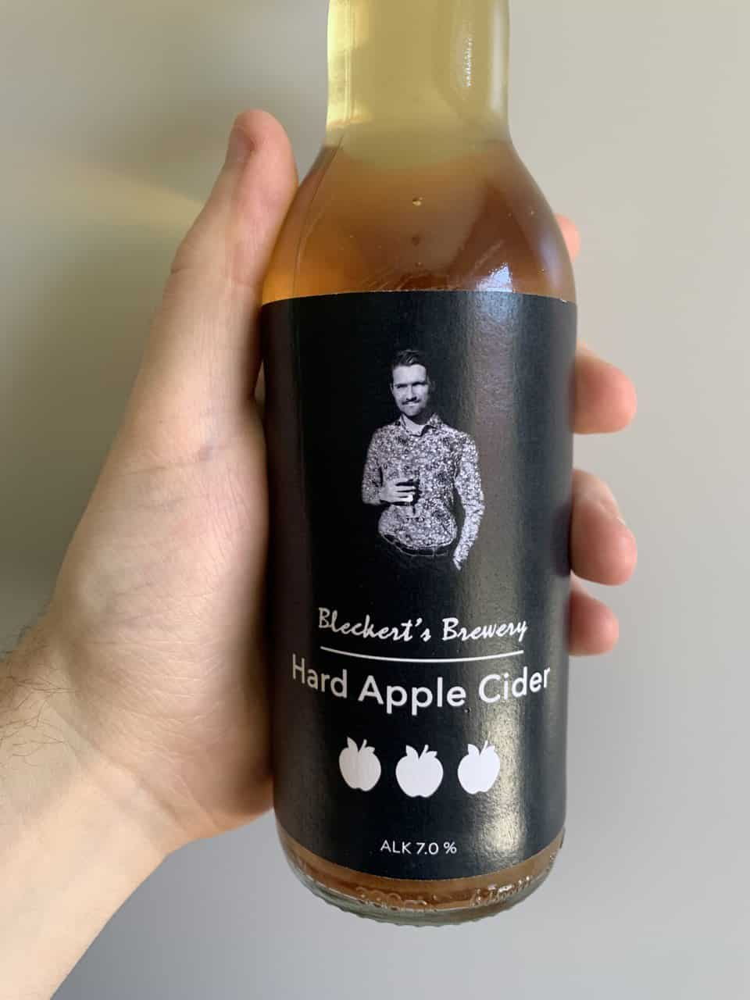
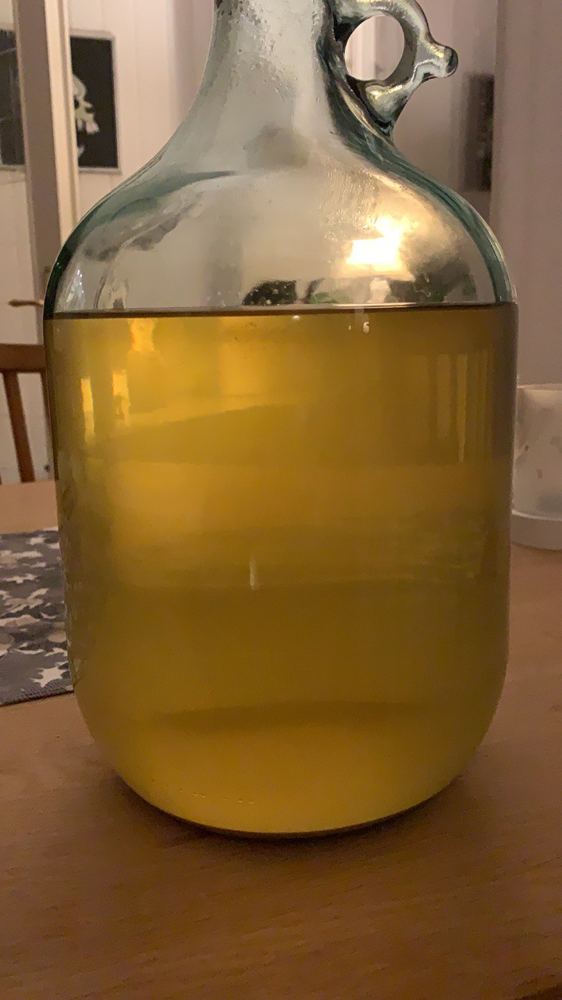
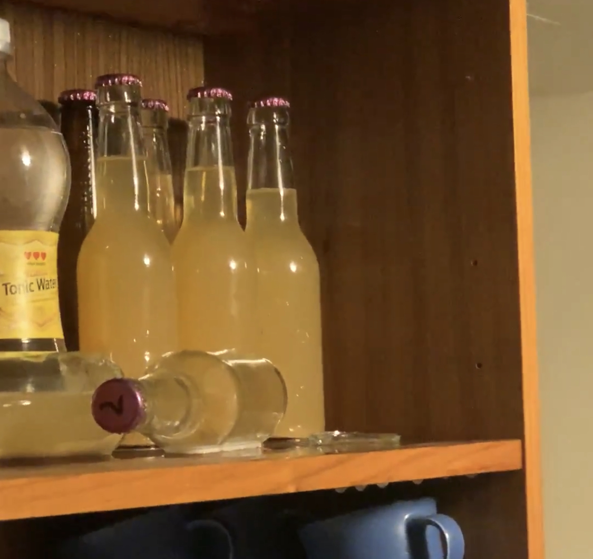
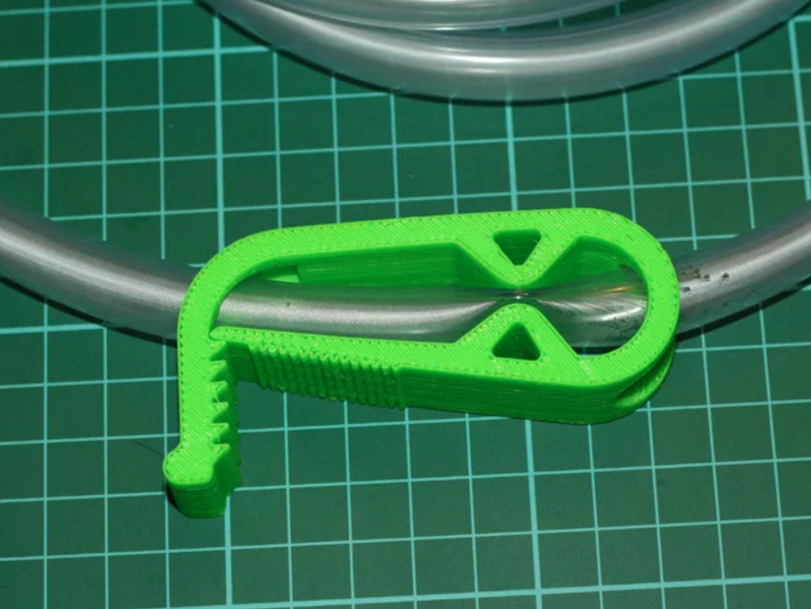

# Recept

## Ingredienser

* Must
* Steriliseringsmedel
* Jäst
* Äppeljuicekoncentrat
* Pektolas (klarningsmedel)

## Instrument

* Kärl (Glasdamejeanne)
* Pumphävert (valfri)
* Kork med vattenlås
* Flaskor
* Kapsyler
* Kapsylverkyg
* Hydrometer
* Mätcylinder

## Steg

1. Pressa musten själv eller köp från butik.
2. Sterilisera glaskärlet (4 gram per liter vatten.).
3. Mät upp en del av musten med hydrometer och anteckna startvärdet.
4. Häll i musten i kärlet.
5. Tillsätt Jäst.
6. Tillsätt pektolas (valfritt)
7. Sätt på vattenlåset och förvara kärlet på ett varmt ställe (10–30 °C).
8. Låt jäsa i ca (1 - 4 veckor) tills det slutar bubbla i vattenlåset.
9. Mät upp en del av cidern med hydrometer och anteckna slutvärdet. Nu kan alkoholhalten räknas ut.
10. Häll upp i flaskor och tillsätt 1 tsk socker och 3 msk koncentrat (justera efter smak).
11. Låt kolsyrejäsa i 2-4 dagar. Jäser den längre än en vecka finns det risk för explosion och cidern blir torrare.
12. Pastörisera sedan cidern för att stoppa jäsningen. Det finns risk för explosion så var försiktig.
13. Låt cidern svalna och sätt in i kylen.
14. Öppna och njut!

# Lärdomar

## Kolsyrejäs inte för länge

I de två första batcherna så stoppade jag aldrig kolsyrejäsningen. Det resulterade i för högt tryck i en av flaskorna som sedan exploderade (flaskbotten flög av).

Smaken påverkas också av den eviga jäsningen. Ju mer det jäser desto mer socker äts upp och gör cidern torrare. Till slut smakar det nästan bara jäst. Min rekommendation är då att endast jäsa i några dagar och sedan pastörisera cidern eller tillsätt jäststopp.

## Kladdigt med pumphävert

Om man ska använda pumphävert så får man vara försiktig med det automatiska suget som häverten skapar. Hävertprincipen bygger på att behållaren som ska fyllas måste befinna sig under höjden från den behållare som töms. Tänk då på att när väl cidern börjar flyta genom slangen så krävs det att du lyfter den ovanför kärlet för att få stopp på flödet. Detta är lätt att glömma när man fyller upp flaskorna och gör att man spiller en del.

Har man tillgång till en 3D-skrivare så kan jag rekommendera en [slangklämma](https://www.thingiverse.com/thing:28447) för att bättre kontrollera och stoppa flödet.

